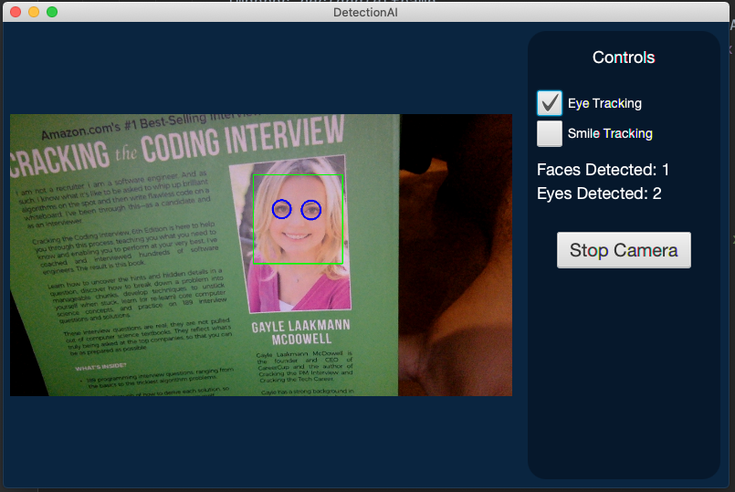

# DetectionAI
This is a GUI application that works with your webcam to be able to detect faces, eyes and smiles. OpenCV provides a lot of different cascade classifiers, I chose the ones that I found were the most successful with different variables such as ambient light. This is written using Java 14, the openCV library and javaFX 14.

To download JavaFX 14 you can find it [here](https://openjfx.io).
You can find download and install instructions for the java openCV library [here](https://opencv-java-tutorials.readthedocs.io/en/latest/01-installing-opencv-for-java.html). 
The instructions have you use Homebrew to install openCV and edit the formula. This ended up taking something like 30 minutes since it was a custom install so keep that in mind.

Opencv installed directory.
`/usr/local/Cellar/opencv/4.4.0/share/java/opencv4`

Make sure you add these to the run configurations to make sure both opencv and javafx libraries are seen by your IDE.
`-Djava.library.path=/usr/local/Cellar/opencv/4.4.0/share/java/opencv4 --module-path {your path}/javafx-sdk-14.0.2.1/lib --add-modules javafx.controls,javafx.fxml`

